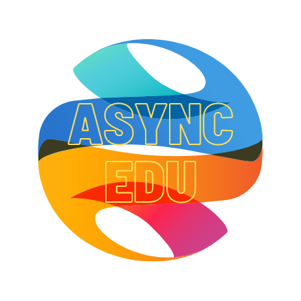

# README

# Project: AsyncEdu



## Description

This single-page-application (SPA) uses a REACT front-end and a RAILS API with a PostgreSQL database to create a chat based application that can be used for remote or asynchronous instructional support, communication, and collaboration.

The objective of the application is for users to be able to communicate with other members of a class or course. Users that are teachers can create classrooms to which students are able to enroll from the course catalog. Once created (or enrolled) the users can communicate with other members of that class in a chatroom for that class.

There are unique chatrooms for each class, allowing students to be enrolled in many classes and participate in class specific chats, as well as teachers being able to create classrooms, as well as participate in the chatrooms with their students.

A video tour of the interface and features can be found HERE --> <<link>>

## Stack and Requirements

- React 18.2.0
- Ruby 2.7.4
- NodeJS (v16), and npm
- Postgresql
- BCrypt
- React-Router-DOM 6.5

## Setup

### Install NodeJS

Verify which version of Ruby you're running by entering this in the terminal:

```sh
ruby -v
```

Make sure that the Ruby version you're running is listed in the [supported
runtimes][] by Heroku. At the time of writing, supported versions are 2.6.8,
2.7.4, or 3.0.2. Our recommendation is 2.7.4, but make sure to check the site
for the latest supported versions.

If it's not, you can use `rvm` to install a newer version of Ruby:

```sh
rvm install 2.7.4 --default
```

You should also install the latest versions of `bundler` and `rails`:

```sh
gem install bundler
gem install rails
```

[supported runtimes]: https://devcenter.heroku.com/articles/ruby-support#supported-runtimes

### Install NodeJS

Verify you are running a recent version of Node with:

```sh
node -v
```

If your Node version is not 16.x.x, install it and set it as the current and
default version with:

```sh
nvm install 16
nvm use 16
nvm alias default 16
```

You can also update your npm version with:

```sh
npm i -g npm
```

### Install Postgresql

Heroku requires that you use PostgreSQL for your database instead of SQLite.
PostgreSQL (or just Postgres for short) is an advanced database management
system with more features than SQLite. If you don't already have it installed,
you'll need to set it up.

#### PostgreSQL Installation for WSL

To install Postgres for WSL, run the following commands from your Ubuntu terminal:

```sh
sudo apt update
sudo apt install postgresql postgresql-contrib libpq-dev
```

Then confirm that Postgres was installed successfully:

```sh
psql --version
```

Run this command to start the Postgres service:

```sh
sudo service postgresql start
```

Finally, you'll also need to create a database user so that you are able to
connect to the database from Rails. First, check what your operating system
username is:

```sh
whoami
```

If your username is "ian", for example, you'd need to create a Postgres user
with that same name. To do so, run this command to open the Postgres CLI:

```sh
sudo -u postgres -i
```

From the Postgres CLI, run this command (replacing "ian" with your username):

```sh
createuser -sr ian
```

Then enter `control + d` or type `logout` to exit.

[This guide][postgresql wsl] has more info on setting up Postgres on WSL if you
get stuck.

[postgresql wsl]: https://docs.microsoft.com/en-us/windows/wsl/tutorials/wsl-database#install-postgresql

#### Postgresql Installation for OSX

To install Postgres for OSX, you can use Homebrew:

```sh
brew install postgresql
```

Once Postgres has been installed, run this command to start the Postgres
service:

```sh
brew services start postgresql
```

## Troubleshooting

If you ran into any errors along the way, here are some things you can try to
troubleshoot:

- If you're on a Mac and got a server connection error when you tried to run
  `rails db:create`, one option for solving this problem for Mac users is to
  install the Postgres app. To do this, first uninstall `postgresql` by running
  `brew remove postgresql`. Next, download the app from the
  [Postgres downloads page][postgres downloads page] and install it. Launch the
  app and click "Initialize" to create a new server. You should now be able to
  run `rails db:create`.

- If you're using WSL and got the following error running `rails db:create`:

  ```txt
  PG::ConnectionBad: FATAL:  role "yourusername" does not exist
  ```

  The issue is that you did not create a role in Postgres for the default user
  account. Check [this video](https://www.youtube.com/watch?v=bQC5izDzOgE) for
  one possible fix.

[postgres downloads page]: https://postgresapp.com/downloads.html

## Using the Product

Once you have the repository stored locally, you can launch the application by running a rails server and starting the client in a local environment.

From there, signing up (or using a login after signup) will give you access to the application from a user perspective. Features for each user type (student or teacher) will differ.In order to test the full functionality of the application, having two accounts is ideal so that you can make sure permissions are set properly for each role and that the user-only features are not provided to other non-users or user-types.

This application is NOT deployed as it is a chat application without content moderation. This project serves as a proof of concept relating to the integration of action cable for chatroom creation and management, active storage for profile picture upload, as well as the use React front end and Rails API to create a multi-user, chat-featured application.
